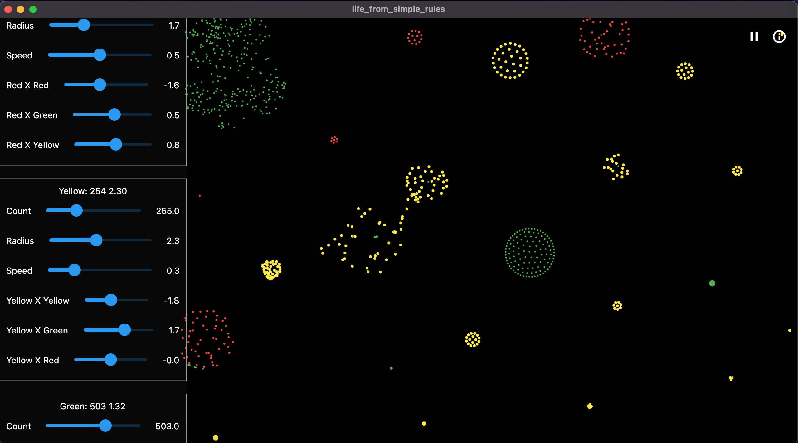
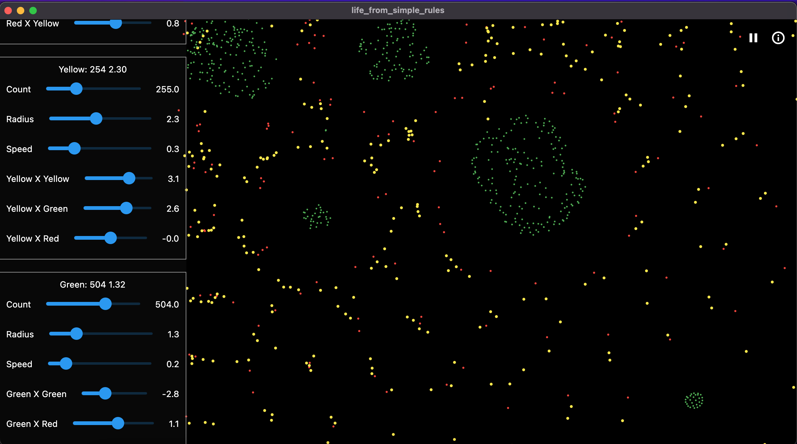

# life_from_simple_rules

Star ⭐ the repo if you like what you see😉.

I created particles which follow simple netwon law's of motion. The particles are attracted to each other and repel each other. 

The particles are attracted to each other by a force which is inversely proportional to the distance between them. The particles repel each other by a force which is inversely proportional to the square of the distance between them.

## How to run

```bash
    git clone https://github.com/AgnelSelvan/simulation.git
    cd life_from_simple_rules
    flutter pub get
    flutter run -d chrome
```

## Outputs


